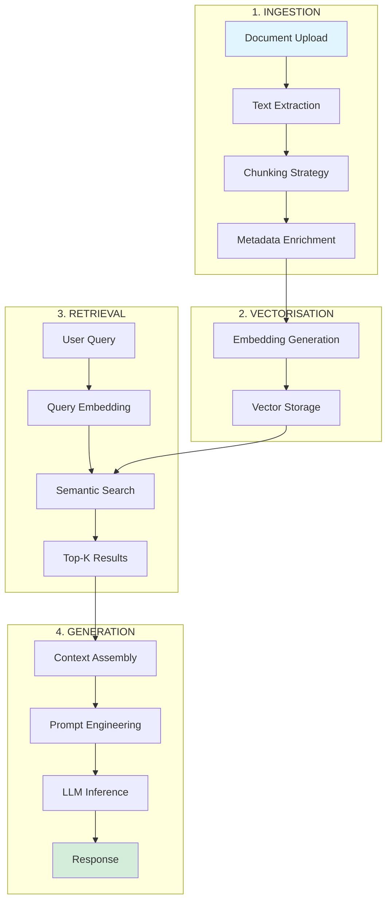

# 🏗️ Architecture Overview - OceanP RAG Platform

> **Version publique simplifiée - Focus vision produit et architecture logique**

---

## 📐 Principes Architecturaux

### 1. **Architecture N-Tiers**

Séparation stricte des responsabilités en 5 couches isolées :

```
┌─────────────────────────────────────┐
│        PRÉSENTATION                 │  ← Interface utilisateur
│  React • CoreUI • Chat Interfaces   │
└─────────────────────────────────────┘
              ↓ HTTP/REST
┌─────────────────────────────────────┐
│        APPLICATION                  │  ← Logique métier
│  APIs REST • Reverse Proxy          │
└─────────────────────────────────────┘
              ↓ gRPC/HTTP
┌─────────────────────────────────────┐
│        INTELLIGENCE                 │  ← LLM Processing
│  Ollama • RAG Pipeline              │
└─────────────────────────────────────┘
              ↓ SQL/NoSQL
┌─────────────────────────────────────┐
│        DONNÉES                      │  ← Persistance
│  PostgreSQL • MongoDB • Qdrant      │
└─────────────────────────────────────┘
              ↓ Metrics
┌─────────────────────────────────────┐
│        OBSERVABILITÉ                │  ← Monitoring
│  Prometheus • Grafana • Loki        │
└─────────────────────────────────────┘
```

**Bénéfices :**
- Isolation des préoccupations
- Scalabilité par couche
- Maintenabilité accrue
- Testabilité facilitée

### 2. **Segmentation Réseau**

Isolation réseau par domaine fonctionnel (Zero Trust) :

| Zone | Rôle | Services |
|------|------|----------|
| **EDGE** | Exposition externe | Reverse proxy, Frontend |
| **INTERNAL** | APIs inter-services | Backend APIs, orchestration |
| **AI** | LLM Processing | Ollama, embeddings |
| **DATA** | Stockage isolé | Bases de données |
| **OPS** | Monitoring | Prometheus, Grafana, Loki |

**Règles de communication :**
- EDGE → INTERNAL uniquement
- INTERNAL ↔ AI, DATA, OPS
- DATA : aucun accès direct externe
- Chaque zone = réseau Docker dédié

### 3. **Microservices Containerisés**

19 services Docker orchestrés :

```yaml
Services:
  # Présentation (3)
  - Frontend Dashboard (React)
  - Open WebUI (Chat IA)
  - LibreChat (RAG alternatif)
  
  # Application (4)
  - Caddy (Reverse Proxy)
  - System API (Métriques)
  - Mission Factory API
  - Stack Observability API
  
  # Intelligence (1)
  - Ollama (5 LLMs locaux)
  
  # Données (5)
  - Qdrant (Vector DB)
  - PostgreSQL + pgvector
  - MongoDB
  - Redis
  - n8n (Automation DB)
  
  # Observabilité (6)
  - Prometheus
  - Grafana
  - Loki
  - Promtail
  - cAdvisor
  - Node Exporter
```

---

## 🔄 Pipeline RAG (Retrieval-Augmented Generation)

### Architecture RAG Complète



### Composants Clés

#### 1️⃣ **Chunking Stratégique**
- Découpage intelligent par paragraphes
- Overlap pour préserver contexte
- Metadata : source, date, auteur, section
- Taille optimale : 500-1000 tokens

#### 2️⃣ **Embeddings Locaux**
- Modèle : `nomic-embed-text` (274 MB)
- Dimension : 768
- Latence : ~50-100ms/chunk
- 100% local (zéro API externe)

#### 3️⃣ **Recherche Vectorielle**
- Base : Qdrant (HNSW index)
- Métrique : Cosine similarity
- Top-K retrieval : configurable (défaut 5)
- Filtrage par metadata

#### 4️⃣ **Génération Contextuelle**
- LLMs : Mistral 7B, Llama 3.1, Qwen
- Prompt engineering : système + contexte + query
- Streaming responses
- Token tracking

---

## 🛡️ Sécurité & Gouvernance

### Principes Appliqués

```
┌─────────────────────────────────────────────┐
│  SOUVERAINETÉ                               │
│  • Zéro dépendance cloud externe            │
│  • Données hébergées localement             │
│  • LLMs auto-hébergés                       │
└─────────────────────────────────────────────┘
         ↓
┌─────────────────────────────────────────────┐
│  SEGMENTATION RÉSEAU                        │
│  • Isolation par domaine fonctionnel        │
│  • Principe du moindre privilège            │
│  • Pas d'accès direct aux données           │
└─────────────────────────────────────────────┘
         ↓
┌─────────────────────────────────────────────┐
│  SECRETS MANAGEMENT                         │
│  • Variables d'env (jamais hardcodées)      │
│  • Génération automatique (JWT, keys)       │
│  • .gitignore strict                        │
└─────────────────────────────────────────────┘
         ↓
┌─────────────────────────────────────────────┐
│  AUDIT & TRAÇABILITÉ                        │
│  • Logs centralisés (Loki)                  │
│  • Métriques exhaustives (Prometheus)       │
│  • Rétention configurable                   │
└─────────────────────────────────────────────┘
```

### Conformité RGPD

- ✅ **Data minimization** : seules les données nécessaires
- ✅ **Storage limitation** : rétention configurable
- ✅ **Right to erasure** : suppression via API
- ✅ **Data portability** : export JSON/CSV
- ✅ **Accountability** : logs d'audit complets

---

## 📊 Observabilité Production-Ready

### Stack Monitoring

```
┌──────────────────────────────────────────────────┐
│  COLLECTE                                        │
│  • node-exporter → Métriques système (CPU/RAM)  │
│  • cAdvisor      → Métriques containers         │
│  • APIs custom   → Métriques applicatives       │
└──────────────────────────────────────────────────┘
         ↓
┌──────────────────────────────────────────────────┐
│  AGRÉGATION                                      │
│  • Prometheus    → Time-series DB (15j retention)│
│  • Loki          → Logs centralisés (30j)        │
└──────────────────────────────────────────────────┘
         ↓
┌──────────────────────────────────────────────────┐
│  VISUALISATION                                   │
│  • Grafana       → 3 dashboards temps réel       │
│  • Alerting      → Seuils configurables          │
└──────────────────────────────────────────────────┘
```

### Métriques Clés (SLIs)

| Métrique | SLI Target | Mesure |
|----------|-----------|--------|
| **Latence RAG** | <3s (p95) | Temps total requête → réponse |
| **Disponibilité** | >99% | Uptime services critiques |
| **Throughput** | >10 req/s | Capacité simultanée |
| **Précision Retrieval** | >85% | Top-5 recall |
| **Token/s (LLM)** | >20 tok/s | Vitesse génération |

---

## 🔄 Déploiement & Automation

### One-Command Deployment

```bash
make install    # Installation complète
make up         # Démarrage stack
make health     # Vérification santé
make status     # État services
```

### CI/CD Ready

```
┌─────────────────────────────────────┐
│  BUILD                              │
│  • Docker images multi-stage        │
│  • Frontend: npm build optimisé     │
│  • Backend: Python wheels           │
└─────────────────────────────────────┘
         ↓
┌─────────────────────────────────────┐
│  TEST                               │
│  • Unit tests (pytest, jest)        │
│  • Integration tests (API)          │
│  • Health checks automated          │
└─────────────────────────────────────┘
         ↓
┌─────────────────────────────────────┐
│  DEPLOY                             │
│  • Docker Compose orchestration     │
│  • Health checks validation         │
│  • Rollback automatique si échec    │
└─────────────────────────────────────┘
```

---

## 🎯 Scalabilité

### Axes d'Évolution

#### Vertical Scaling (Court terme)
- ✅ Ressources configurables par service
- ✅ Limites CPU/RAM dans docker-compose
- ✅ Auto-restart on failure

#### Horizontal Scaling (Moyen terme)
- 🔄 Docker Swarm mode
- 🔄 Load balancing HAProxy/Caddy
- 🔄 Redis distributed cache

#### Cloud-Native (Long terme)
- 🎯 Migration Kubernetes
- 🎯 Object storage (S3-compatible)
- 🎯 Managed databases (si besoin)

---

## 💡 Patterns Architecturaux

### 1. **Event-Driven Architecture**
```
n8n Workflows → Webhooks → Services → Event Bus → Consumers
```

### 2. **API Gateway Pattern**
```
Client → Caddy (Gateway) → Backend APIs → Services
```

### 3. **Circuit Breaker**
```python
# Implémenté dans backend/circuit_breaker.py
- Fail fast si service down
- Retry avec backoff exponentiel
- Fallback graceful
```

### 4. **Health Check Pattern**
```yaml
healthcheck:
  test: ["CMD", "curl", "-f", "http://localhost:PORT/health"]
  interval: 30s
  timeout: 10s
  retries: 3
```

---

## 🚀 Avantages Compétitifs

### vs. Solutions Cloud

| Critère | Cloud Managed | Cette Stack |
|---------|--------------|-------------|
| **Souveraineté** | ❌ Données externalisées | ✅ 100% local |
| **Coût récurrent** | $$$ mensuel | ✅ Coût fixe serveur |
| **Latence** | Variable (réseau) | ✅ <50ms (local) |
| **Conformité** | ⚠️ Dépend fournisseur | ✅ Contrôle total |
| **Customisation** | ⚠️ Limitée | ✅ Illimitée |
| **Vendor lock-in** | ❌ Élevé | ✅ Zéro |

### vs. Solutions On-Premise Traditionnelles

| Critère | Legacy Monolithe | Cette Stack |
|---------|-----------------|-------------|
| **Scalabilité** | ❌ Difficile | ✅ Par service |
| **Maintenance** | ❌ Complexe | ✅ Containerisée |
| **Monitoring** | ⚠️ Limité | ✅ Production-grade |
| **Déploiement** | ❌ Manuel | ✅ Automatisé |
| **Recovery** | ⚠️ Lent | ✅ Rapide (volumes) |

---

## 📚 Ressources Complémentaires

### Documentation Technique (Privée)
- Architecture détaillée
- Configuration réseau complète
- Scripts d'automation
- Procédures opérationnelles

### Cette Documentation (Publique)
- ✅ Vision produit
- ✅ Architecture logique
- ✅ Patterns appliqués
- ✅ Use cases métier

---

*Architecture Overview v1.0 - Février 2026*
