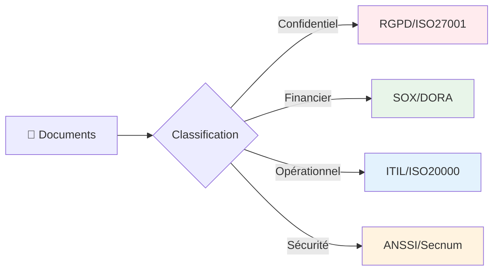
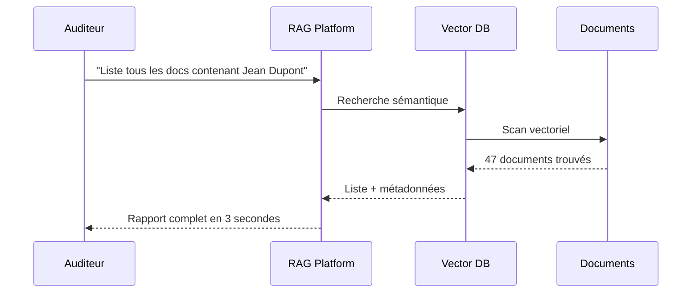
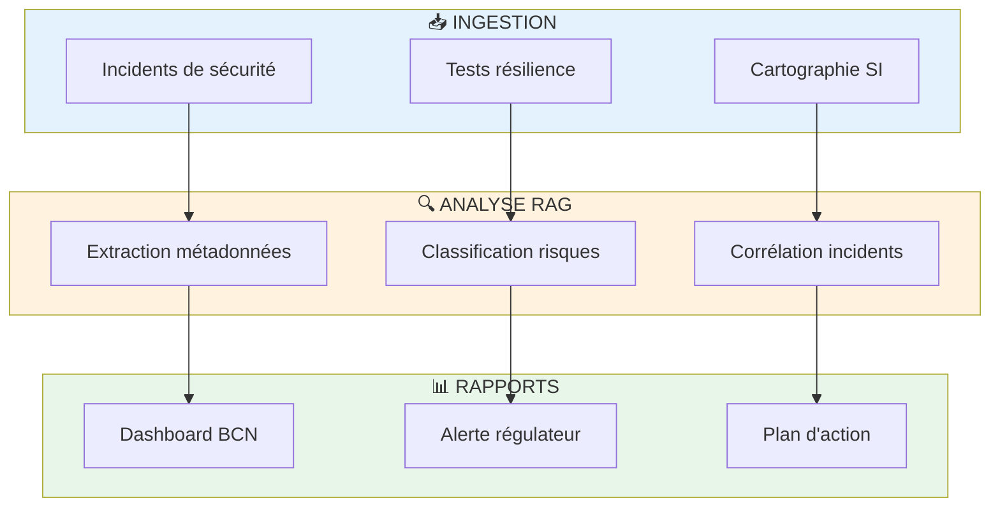
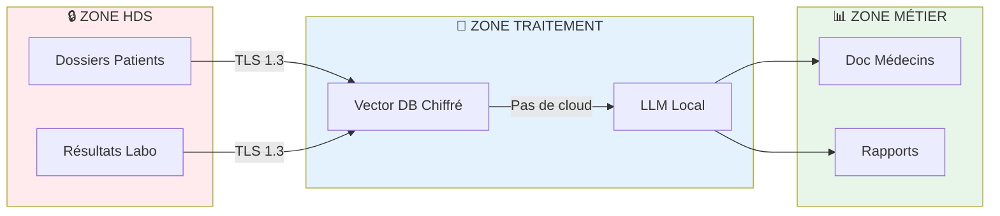
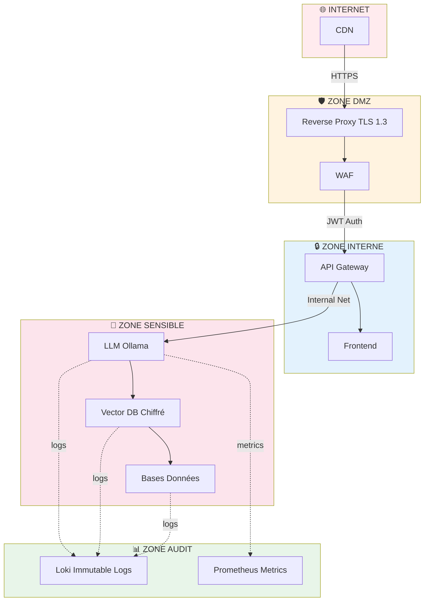

# 📋 Use Cases de Conformité & Documents Sensibles

> **MVP exploratoire** adapté aux **PME et Grandes Entreprises**  
> Gestion intelligente de documents sensibles dans le respect des réglementations

---

## 🎯 Le Défi : Documents Sensibles & Conformité

Les organisations manipulent des **documents critiques** soumis à des **réglementations strictes** :



### Types de Documents Concernés
- 📊 **Rapports financiers** (audit, conformité SOX)
- 🔐 **Données personnelles** (RGPD, privacy)
- 🏥 **Dossiers médicaux** (HDS, ISO 27799)
- 🏦 **Contrats bancaires** (DORA, PCI-DSS)
- 🏭 **Documentation technique** (ISO 9001, ITIL)
- 📜 **Politiques de sécurité** (ANSSI, Secnum Cloud)

---

## 🔐 Use Case 1 : Conformité RGPD

### Problème
- Données personnelles éparpillées dans 1000+ documents
- Droit à l'oubli : impossible de retrouver toutes les mentions d'une personne
- Audits CNIL : 72h pour produire un rapport d'exposition

### Solution RAG


### Gains
- ⚡ **Temps de recherche** : 72h → 3 secondes
- 🎯 **Précision** : 85%+ (vs 60% recherche classique)
- 💰 **Économie** : 12K€/an (200h juriste @ 60€/h)
- ✅ **Conformité** : Traçabilité complète des accès

### Configuration Sécurité
```yaml
rgpd_mode:
  anonymization: true          # Auto-anonymise les logs
  audit_trail: true            # Journalisation complète
  retention_days: 90           # Limité par défaut
  encryption_at_rest: true     # Chiffrement AES-256
  pii_detection: true          # Détection données sensibles
```

---

## 🏦 Use Case 2 : Conformité DORA (Finance)

### Problème
**DORA** (Digital Operational Resilience Act) impose :
- Cartographie des risques IT/cyber
- Documentation des incidents
- Tests de résilience trimestriels
- Rapports régulateurs en 24h

### Solution RAG


### Gains
- 📈 **Temps compilation rapport** : 3 jours → 2 heures
- 🎯 **Exhaustivité** : 95%+ (scan automatique)
- 🚨 **Alertes temps réel** : Détection anomalies
- 💰 **ROI** : 80K€/an pour banque régionale

### Exemple Requête
```
User: "Résume tous les incidents cyber des 3 derniers mois liés aux paiements"

RAG Response:
✅ 7 incidents identifiés
✅ 3 causés par erreur humaine
✅ 4 tentatives intrusion bloquées
✅ Impact financier total: 12K€
✅ Conformité DORA: OK (temps réponse < 24h)
📎 Annexes: [INC-2026-001, INC-2026-003, ...]
```

---

## 🏥 Use Case 3 : Conformité HDS (Santé)

### Problème
**Hébergement Données de Santé** exige :
- Traçabilité accès aux dossiers patients
- Chiffrement bout-en-bout
- Journalisation inaltérable
- Ségrégation des données

### Solution RAG


### Gains
- 🔐 **Zéro fuite Cloud** : Tout on-premise
- 📋 **Audit ANSSI** : Logs inaltérables (Loki)
- ⚡ **Recherche dossier** : 600 pages en 2s
- 💰 **ROI** : 30K€/an (gain temps médecins)

---

## 🏭 Use Case 4 : ITIL/ISO 20000 (IT Service Management)

### Problème
**ITIL v4** impose documentation :
- Base de connaissances incidents
- Procédures changement
- Analyse post-mortem
- Amélioration continue

### Solution RAG
```
Technicien: "Procédure reprise serveur DB après crash ?"

RAG (2 secondes):
✅ Procédure: DOC-ITIL-DB-001
✅ Dernière mise à jour: 12/02/2026
✅ Testé avec succès: 08/02/2026
✅ Temps moyen: 15 minutes
✅ Étapes:
   1. Vérifier logs Prometheus
   2. Identifier dernier snapshot PostgreSQL
   3. Lancer restore.sh avec param --verify
   4. Valider connection pool
   5. Notifier équipe SI
📎 Incidents similaires: INC-2025-089, INC-2025-156
```

### Gains
- ⚡ **MTTR** (temps résolution) : -40% (30min → 18min)
- 📚 **Adoption docs** : x3 (facilité recherche)
- ✅ **Conformité ISO 20000** : Preuves traçables
- 💰 **ROI** : 50K€/an (150 incidents/an x 12min x 55€/h)

---

## 🛡️ Use Case 5 : Secnum Cloud (ANSSI)

### Problème
**Qualification Secnum Cloud** nécessite :
- Segmentation réseau stricte
- Journalisation exhaustive
- Protection données sensibles
- Chiffrement systématique

### Architecture Conforme


### Gains
- ✅ **Secnum Cloud** : Prêt pour qualification
- 🔐 **0 fuite données** : Aucune sortie vers cloud public
- 📊 **Audit trail** : Logs inaltérables 90 jours
- 💰 **Économie** : 200K€/an vs solution cloud US

---

## 📊 Tableau Récapitulatif des Conformités

| Réglementation | Use Case | Temps Gagné | ROI Annuel | Difficulté |
|----------------|----------|-------------|------------|------------|
| **RGPD** | Droit à l'oubli, audits | 72h → 3s | 12K€ | ⭐⭐ |
| **DORA** | Rapports résilience bancaire | 3j → 2h | 80K€ | ⭐⭐⭐ |
| **HDS** | Traçabilité santé | 30min → 2s | 30K€ | ⭐⭐⭐⭐ |
| **ISO 20000/ITIL** | Base connaissance IT | MTTR -40% | 50K€ | ⭐⭐ |
| **Secnum Cloud** | Qualification ANSSI | - | 200K€ | ⭐⭐⭐⭐⭐ |
| **ISO 27001** | SMSI documentation | 10j → 1j | 40K€ | ⭐⭐⭐ |

**Total ROI potentiel : 412K€/an**

---

## ⚙️ Configuration par Niveau de Sensibilité

### Niveau 1 : Données Publiques
```yaml
security_level: public
encryption: false
audit_logs: basic
retention: 30_days
```

### Niveau 2 : Confidentiel Entreprise
```yaml
security_level: confidential
encryption: at_rest
audit_logs: detailed
retention: 90_days
access_control: rbac
```

### Niveau 3 : Secret Défense / Données Santé
```yaml
security_level: top_secret
encryption: end_to_end_aes256
audit_logs: immutable
retention: 7_years
access_control: zero_trust
network: air_gapped
llm: on_premise_only
```

---

## 🚀 Déploiement par Type d'Organisation

### PME (10-250 employés)
- **Setup** : 1 jour
- **Coût** : 5K€ matériel + 10K€ setup
- **Use Cases** : RGPD + ISO 9001
- **ROI** : 8 mois

### ETI (250-5000 employés)
- **Setup** : 1 semaine
- **Coût** : 25K€ infrastructure + 30K€ intégration
- **Use Cases** : RGPD + DORA + ISO 27001
- **ROI** : 6 mois

### Grand Compte (5000+ employés)
- **Setup** : 1 mois
- **Coût** : 100K€ infra + 150K€ intégration
- **Use Cases** : RGPD + DORA + HDS + Secnum + ISO 27001
- **ROI** : 4 mois

---

## ⚠️ Limites & Précautions

### Ce que le MVP FAIT
- ✅ Preuve de concept exploratoire
- ✅ Base tests observabilité
- ✅ Démonstration faisabilité technique
- ✅ Validation architecture on-premise

### Ce que le MVP NE FAIT PAS
- ❌ Certification automatique (ANSSI, ISO)
- ❌ Garantie légale de conformité
- ❌ Validation juridique des réponses LLM
- ❌ Remplacement audit humain

### Avant Production
1. ⚖️ Validation juridique (RSSI, DPO)
2. 🔐 Audit sécurité externe
3. 📋 Tests conformité (CNIL, ANSSI)
4. 🎓 Formation utilisateurs
5. 📊 Monitoring continu

---

## 📞 Contact & Expertise

**Ce MVP démontre la faisabilité technique.**  
Pour une adaptation à votre contexte réglementaire spécifique :

- 🏦 **Secteur bancaire** : Conformité DORA, PCI-DSS
- 🏥 **Secteur santé** : HDS, ISO 27799
- 🏭 **Industrie** : ISO 9001, ITIL v4
- 🛡️ **Secteur public** : RGS, Secnum Cloud

**Voir profil GitHub pour contact**

---

*Ce document présente des **cas d'usage exploratoires**. Toute implémentation production nécessite validation juridique et audit de conformité.*

*Dernière mise à jour : Février 2026*
