# 🌊 OceanP RAG Platform - Showcase Documentation

> **Une plateforme d'IA souveraine professionnelle**  
> Conçue, architécturée et développée pour démontrer qu'un Data Product Manager peut piloter ET builder.

---

## 🎯 Vision Stratégique

Cette plateforme n'est pas un simple POC. C'est une **preuve opérationnelle** qui démontre :

### 1️⃣ **Souveraineté Technologique**
- ✅ 100% auto-hébergé (zéro dépendance cloud externe)
- ✅ LLMs locaux (Ollama) - pas d'appels API externes
- ✅ Contrôle total des données
- ✅ Conformité RGPD by design

### 2️⃣ **Architecture Professionnelle**
- ✅ N-tiers (5 couches isolées)
- ✅ Segmentation réseau multi-zones
- ✅ Microservices containerisés (19 services)
- ✅ Observabilité production-ready

### 3️⃣ **Scalabilité & Gouvernance**
- ✅ Métriques temps réel (Prometheus/Grafana)
- ✅ Logs centralisés (Loki)
- ✅ API REST pour intégrations externes
- ✅ Backup & disaster recovery

---

## 🏗️ Architecture Logique

### Stack Technologique

```
┌─────────────────────────────────────────────────────────┐
│                   PRÉSENTATION                          │
│  React 19 • CoreUI 5 • Open WebUI • LibreChat          │
└─────────────────────────────────────────────────────────┘
                           ↓
┌─────────────────────────────────────────────────────────┐
│                   APPLICATION                            │
│  APIs REST • Caddy Reverse Proxy • Mission Factory     │
└─────────────────────────────────────────────────────────┘
                           ↓
┌─────────────────────────────────────────────────────────┐
│                   INTELLIGENCE                           │
│  Ollama (5 LLMs locaux) • RAG Pipeline                 │
│  Mistral 7B • Llama 3.1 • Phi3 • Qwen • Nomic         │
└─────────────────────────────────────────────────────────┘
                           ↓
┌─────────────────────────────────────────────────────────┐
│                   DONNÉES                                │
│  Qdrant (vectoriel) • PostgreSQL • MongoDB • Redis     │
└─────────────────────────────────────────────────────────┘
                           ↓
┌─────────────────────────────────────────────────────────┐
│                   OBSERVABILITÉ                          │
│  Prometheus • Grafana • Loki • cAdvisor • n8n          │
└─────────────────────────────────────────────────────────┘
```

### Segmentation Réseau

```
┌─────────────────────────────────────────────────────────┐
│  EDGE        → Exposition publique (Caddy)              │
├─────────────────────────────────────────────────────────┤
│  INTERNAL    → APIs inter-services                      │
├─────────────────────────────────────────────────────────┤
│  AI          → LLM processing (isolation)               │
├─────────────────────────────────────────────────────────┤
│  DATA        → Bases isolées (zéro accès direct)        │
├─────────────────────────────────────────────────────────┤
│  OPS         → Monitoring & automation                  │
└─────────────────────────────────────────────────────────┘
```

**Principe :** Chaque zone ne communique qu'avec les zones autorisées. Zéro trust by design.

---

## 💡 Capacités Démontrées

### 1. **Pipeline RAG Complet**

```
Document Upload → Embedding → Vectorisation → Retrieval → Génération
```

- Ingestion multi-formats (PDF, DOCX, TXT, Markdown)
- Chunking intelligent + métadonnées
- Embeddings locaux (nomic-embed-text)
- Recherche sémantique (Qdrant)
- Génération contextuelle (Mistral/Llama)

**Traçabilité complète :** Chaque étape est mesurée, loggée, observable.

### 2. **Observabilité Production**

- **Métriques système** : CPU, RAM, disques, réseau (node-exporter)
- **Métriques applicatives** : latence, throughput, erreurs (APIs REST)
- **Métriques containers** : ressources Docker (cAdvisor)
- **Dashboards temps réel** : Grafana (3 dashboards intégrés)
- **Logs centralisés** : Loki + Promtail
- **Alerting** : Prometheus AlertManager

### 3. **Automation & Workflows**

- **n8n** : Orchestration de workflows complexes
- **Mission Factory** : Génération automatisée de documents
- **APIs REST** : Intégration Power BI, Notion, Slack
- **Déploiement** : One-command via Makefile

---

## 📊 Composants Principaux

| Composant | Rôle | Technologie |
|-----------|------|-------------|
| **Ollama** | LLM Inference | Mistral 7B, Llama 3.1, Phi3, Qwen |
| **Open WebUI** | Interface chat IA | React + Qdrant RAG |
| **Qdrant** | Vector Database | Recherche sémantique |
| **PostgreSQL** | Base relationnelle | pgvector (embeddings) |
| **MongoDB** | Documents/Conversations | Schemaless storage |
| **Redis** | Cache distribué | Sessions + queue |
| **Grafana** | Visualisation | Dashboards temps réel |
| **Prometheus** | Métriques | Time-series DB |
| **Loki** | Logs | Agrégation centralisée |
| **Caddy** | Reverse Proxy | HTTPS auto-signé |
| **n8n** | Automation | Workflow orchestration |

---

## 🎓 Points Forts Techniques

### Architecture
- ✅ **Modularité** : Chaque service est isolé, remplaçable
- ✅ **Scalabilité** : Ressources configurables par service
- ✅ **Résilience** : Health checks + auto-restart
- ✅ **Sécurité** : Segmentation réseau + secrets management

### Data Product Management
- ✅ **Vision produit** : chaque composant répond à un besoin métier
- ✅ **Métriques clés** : définition des KPIs (latence, tokens, retrieval accuracy)
- ✅ **Gouvernance** : traçabilité, audit logs, compliance
- ✅ **Documentation** : architecture as code, diagrammes vivants

### DevOps / SRE
- ✅ **Infrastructure as Code** : Docker Compose multi-fichiers
- ✅ **CI/CD ready** : Makefile, scripts automation
- ✅ **Monitoring** : SLIs/SLOs définis
- ✅ **Backup/Restore** : Stratégie de disaster recovery

---

## 🚀 Workflow de Démonstration

### Scénario RAG End-to-End

```mermaid
graph LR
    A[Upload Document] --> B[Text Extraction]
    B --> C[Chunking]
    C --> D[Embedding Generation]
    D --> E[Vector Storage Qdrant]
    E --> F[User Query]
    F --> G[Semantic Search]
    G --> H[Context Retrieval]
    H --> I[LLM Generation]
    I --> J[Structured Response]
    
    style A fill:#e1f5ff
    style J fill:#d4edda
```



**Mesures collectées :**
- Temps d'embedding : ~200ms/chunk
- Latence recherche vectorielle : <50ms
- Génération LLM : 1-3s (Mistral 7B)
- Précision retrieval : 85%+ (top-5)

---

## 🎯 Use Cases Métier

### 1. **Veille Stratégique Automatisée**
- Ingestion articles/rapports
- Classification automatique
- Extraction insights clés
- Génération synthèses exécutives

### 2. **Knowledge Base Interne**
- Centralisation documentaire
- Recherche sémantique intelligente
- Réponses contextuelles instantanées
- Historique conversations

### 3. **Génération de Documents**
- Templates intelligents
- Contextualisation automatique
- Formats multiples (PDF, DOCX, Markdown)
- Workflow validation

---

## 📈 Roadmap & Évolutions

### Phase 1 (Actuelle) ✅
- Stack complète opérationnelle
- 19 microservices orchestrés
- Observabilité production-ready
- Pipeline RAG fonctionnel

### Phase 2 (En cours) 🔄
- Fine-tuning LLM sur corpus métier
- Multimodal (images + texte)
- API GraphQL
- Frontend mobile (React Native)

### Phase 3 (Planifiée) 🎯
- Multi-tenancy
- Orchestration Kubernetes
- GPU acceleration (inference)
- Edge deployment (ARM64)

---

## 💼 Positionnement Stratégique

### Ce projet démontre :

**Compétences Data Product Manager :**
- Vision produit → architecture technique
- Définition métriques → implémentation monitoring
- Roadmap → délivrance opérationnelle
- Gouvernance → industrialisation

**Compétences Techniques :**
- Architecture N-tiers professionnelle
- Stack moderne (Docker, React, APIs REST)
- Observabilité & SRE
- DevOps automation

**Compétences Business :**
- Souveraineté technologique
- ROI démontrée (zéro coût cloud récurrent)
- Scalabilité maîtrisée
- Compliance RGPD

---

## 🔗 Ressources

- **GitHub** : [Rag-Plateform-2026](https://github.com/stepstev/Rag-Plateform-2026)
- **LinkedIn** : [Votre profil LinkedIn]
- **Blog Technique** : [Si applicable]

---

## 📝 Note de Sécurité

Cette documentation est une **version publique simplifiée**.  
Les détails d'implémentation suivants ne sont **PAS** exposés publiquement :

- ❌ Configuration réseau détaillée
- ❌ Schémas d'adressage IP
- ❌ Endpoints secrets
- ❌ Variables d'environnement sensibles
- ❌ Architecture infrastructure complète

**Objectif :** Démontrer les capacités sans exposer l'avantage compétitif.

---

## 🎓 Philosophie du Projet

> "Un Data Product Manager ne se contente pas de piloter.  
> Il conçoit. Il code. Il délivre."

Cette plateforme prouve qu'on peut :
- Structurer une vision produit claire
- L'architecturer professionnellement
- L'implémenter de bout en bout
- La documenter rigoureusement
- La monitorer comme en production

**Du concept au code. Du code à la valeur métier.**

---

*Documentation vitrine v1.0 - Février 2026*
