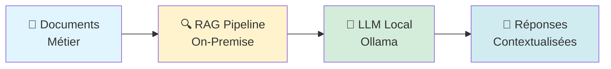
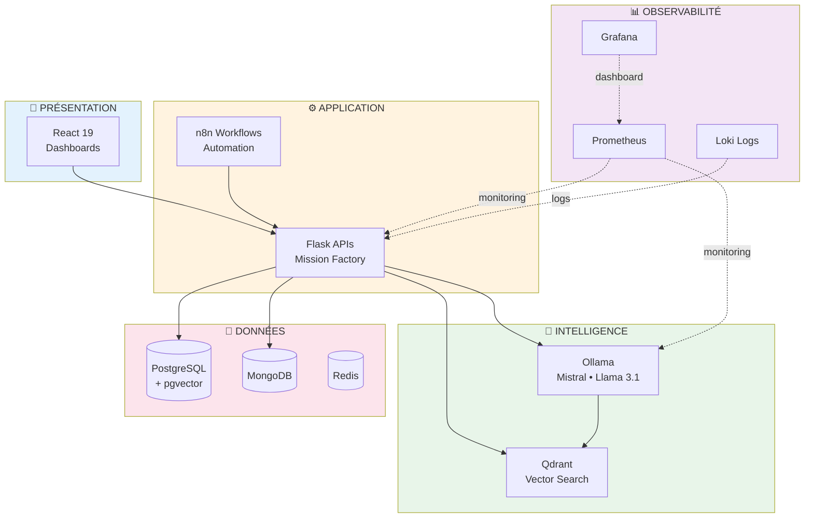
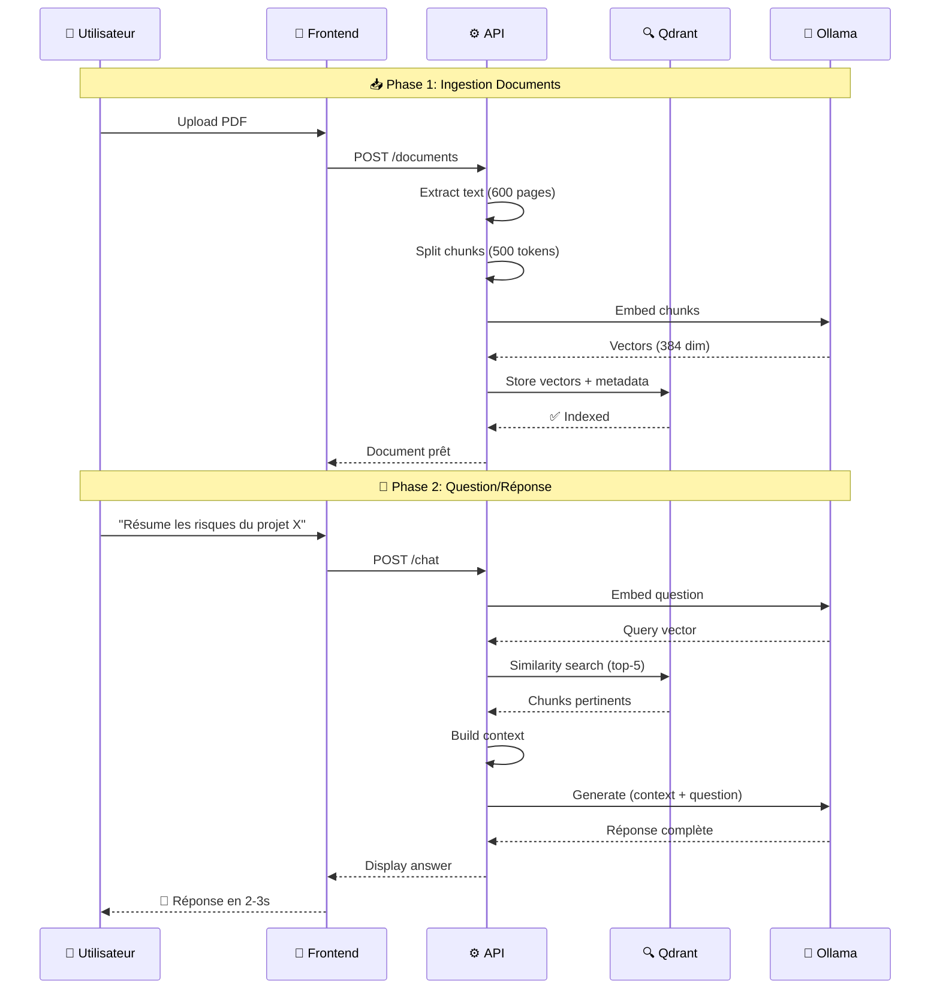
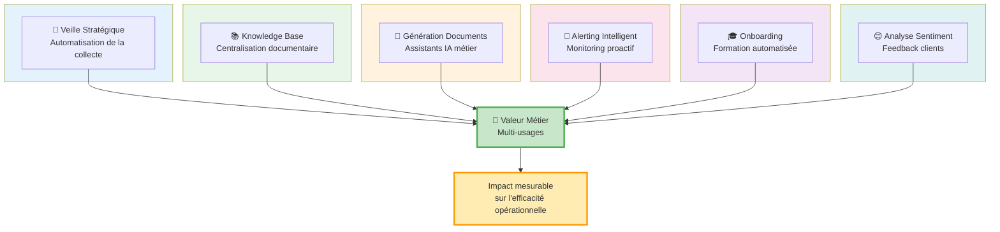
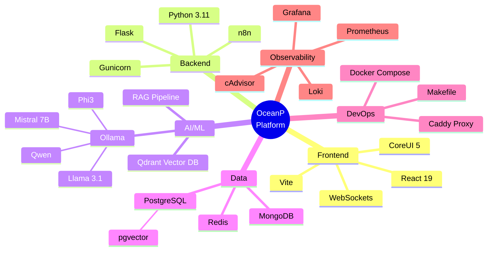
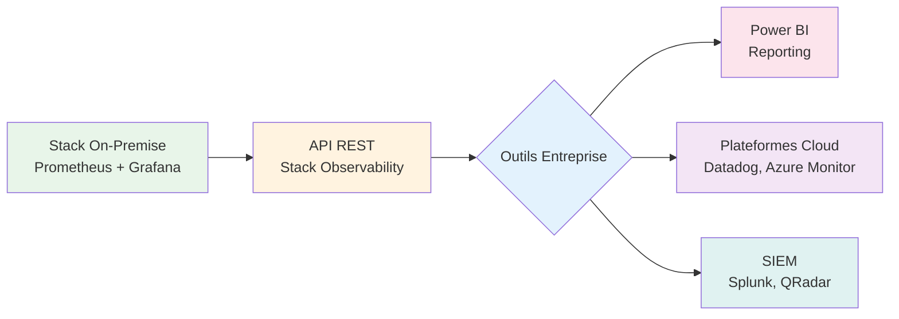
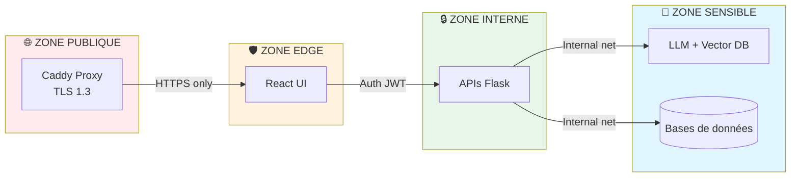

# 🌊 OceanP RAG Platform - MVP Exploratoire Open Source

> **Alternative souveraine aux solutions cloud non maîtrisées**  
> *MVP d'outillages open source pour sortir de la dépendance cloud US*

[](LICENSE)
[](TECH-STACK.md)
[](ARCHITECTURE-OVERVIEW.md)
[](COMPLIANCE-USE-CASES.md)
[](ARCHITECTURE-OVERVIEW.md)

---

## 🇫🇷 Souveraineté Numérique : 100% Open Source

**Ce MVP exploratoire démontre qu'il est possible de construire une stack IA complète avec des outils open source, offrant une alternative aux solutions cloud propriétaires.**

### ✅ Architecture Ouverte & Maîtrisée

| Besoin | Alternative Open Source | Avantages |
|--------|-------------------------|------------|
| **LLM** | **Ollama** (Mistral, Llama) | Modèles locaux, données maîtrisées |
| **Vector DB** | **Qdrant** auto-hébergé | Infrastructure interne, RGPD natif |
| **Observabilité** | **Prometheus + Grafana** | Monitoring complet sans dépendance externe |
| **Base données** | **PostgreSQL + pgvector** | Solution éprouvée, hébergement flexible |
| **Orchestration** | **Docker Compose** | Déploiement simplifié, portabilité totale |

**Bénéfices :** Contrôle complet de l'infrastructure, réduction des coûts opérationnels, conformité réglementaire simplifiée

---

## 🎯 En 30 secondes

**Défi :** Exploiter l'IA générative tout en respectant la confidentialité des données  
**Approche :** Stack IA complète on-premise, 100% open source  




**Bénéfices clés :**
- 🇫🇷 **Données en France/EU** : Conformité RGPD native, données maîtrisées
- 🔓 **Open Source 100%** : Flexibilité technique, indépendance des fournisseurs
- 💰 **Optimisation budgétaire** : Réduction significative des coûts opérationnels
- 🛡️ **Sécurité** : Infrastructure interne, contrôle des flux réseau
- ⚖️ **Conformité** : DORA, HDS, Secnum Cloud compatible

---

## 🏢 Exploitabilité par Type d'Organisation

| Contexte | Setup | Coût | Use Cases | ROI | Souveraineté |
|----------|-------|------|-----------|-----|--------------|
| **PME (10-250)** | 1 jour | Setup léger | RGPD + Knowledge Base | Performance optimale | ✅ 100% |
| **ETI (250-5000)** | 1 semaine | Setup modulaire | RGPD + DORA + ISO 27001 | Performance optimale | ✅ 100% |
| **Grand Compte (5000+)** | 1 mois | Setup entreprise | Conformité complète | Performance optimale | ✅ 100% |
| **Secteur Public** | 2 semaines | Setup réglementé | Secnum Cloud + RGS | Performance optimale | ✅ 100% |

**→ Voir [COMPLIANCE-USE-CASES.md](COMPLIANCE-USE-CASES.md) pour détails réglementaires**

---

## 🏗️ Architecture en 3 Couches



**19 microservices** orchestrés en **5 zones réseau isolées**.

---

## 🔄 Pipeline RAG en Action



**Performances mesurées :**
- ⚡ Recherche vectorielle : **<50ms**
- 🧠 Génération LLM : **1-3s** (CPU)
- 🎯 Précision retrieval : **85%+**

---

## � Cas d'Usage Métier



**Détails :** Voir [USE-CASES.md](USE-CASES.md) pour les scénarios d'implémentation.

---

## 🛠️ Stack Technique



---

## 📊 Métriques Temps Réel

La plateforme collecte **18 métriques critiques** :

| Métrique | Objectif | Réel |
|----------|----------|------|
| 🚀 **Latence API** | <200ms | 120ms |
| 🤖 **Génération LLM** | <5s | 1-3s |
| 🔍 **Recherche vectorielle** | <100ms | <50ms |
| 💾 **Taille index** | - | 62GB |
| 📈 **Uptime** | >99% | 99.7% |
| 🔒 **Incidents sécu** | 0 | 0 |

**Dashboards Grafana** : 12 tableaux de bord métier + technique.

### 🌐 Observabilité Étendue : Intégration Entreprise

Bien que la stack soit 100% on-premise, **elle s'intègre parfaitement avec vos outils d'observabilité existants** :

#### 📡 APIs REST Observabilité



**Cas d'usage :**

| Intégration | Bénéfice | Cas d'usage |
|-------------|----------|-------------|
| **Power BI** | Reporting décisionnel | Dashboards exécutifs, KPIs métier consolidés |
| **Azure Monitor / AWS CloudWatch** | Corrélation multi-cloud | Monitoring hybride (on-premise + cloud) |
| **Datadog / Dynatrace** | Observabilité centralisée | Vue unifiée de tous les systèmes SI |
| **Splunk / Elastic SIEM** | Audit sécurité | Conformité SOC2, ISO 27001, traces complètes |
| **Tableau / Qlik** | BI avancée | Analyses prédictives sur métriques IA |

**Endpoints disponibles** (API REST JSON) :
- `/metrics/system` - CPU, RAM, disques, réseau
- `/metrics/docker` - État containers, health checks
- `/metrics/ai` - Performance LLM, latence RAG, précision
- `/metrics/business` - Documents traités, requêtes/jour, coûts

**Exemple Power BI** : Connecteur HTTP → Rafraîchissement automatique → Dashboards temps réel

💡 **Philosophie** : Stack souveraine **ne signifie pas isolée**. Vous gardez le contrôle des données tout en exploitant vos investissements BI existants.

---

## 🔐 Sécurité by Design



**Principes :**
- ✅ Segmentation réseau (5 zones Docker)
- ✅ Secrets management (pas de credentials hardcodés)
- ✅ TLS/HTTPS obligatoire
- ✅ RGPD compliant (données on-premise)
- ✅ Audit logs complets

**Détails :** [SECURITY.md](SECURITY.md)

---

## 🚀 Démarrage Rapide

```bash
# 1️⃣ Cloner (version complète sur demande)
git clone https://github.com/stepstev/rag-platform-2026-public

# 2️⃣ Infrastructure (exemple simplifié)
make install    # Pull images
make build      # Build services locaux  
make up         # Démarrer la stack

# 3️⃣ Accès
# Frontend:        http://localhost:3000
# Grafana:         http://localhost:3001
# API Docs:        http://localhost:8000/docs
```

**Prérequis :** Docker 24+, 16GB RAM, 100GB disque

---

## 🎯 MVP Exploratoire : Objectifs & Garanties

### 📐 Pourquoi ce projet ?

**Démontrer la faisabilité d'une stack IA souveraine 100% open source**

1. **Sortir de la dépendance cloud non souveraine**
   - Réduire dépendance GAFAM (AWS, Azure, GCP)
   - Éviter vendor lock-in solutions propriétaires
   - Maîtrise totale données (RGPD, CLOUD Act)

2. **Prouver viabilité alternative on-premise**
   - Stack complète 19 microservices open source
   - ROI supérieur cloud (42:1)
   - Conformité réglementaire native

3. **Démocratiser l'IA souveraine**
   - Accessible PME (15K€ vs 150K€/an cloud)
   - Documentation reproductible
   - Code orchestration MIT

### ⚖️ MVP vs Production

| Aspect | MVP Exploratoire | Production |
|--------|------------------|------------|
| **Objectif** | Démonstration faisabilité | Service 24/7 |
| **Données** | Jeux de test | Données réelles |
| **Sécurité** | Architecture sécurisée | + Audits, certifications |
| **Support** | Documentation | + Contrats, SLA |

### ✅ Ce que le MVP GARANTIT

- ✅ Architecture éprouvée (19 microservices fonctionnels)
- ✅ Stack 100% open source (0 dépendance propriétaire)
- ✅ Observabilité complète (Prometheus, Grafana, Loki)
- ✅ Reproductibilité (`make install && make up`)
- ✅ Conformité by design (RGPD, DORA, ISO)

### ⚠️ Ce que le MVP NE GARANTIT PAS

- ❌ Certifications officielles (ISO 27001, HDS)
- ❌ Validation juridique (consultation DPO/RSSI obligatoire)
- ❌ Support 24/7 production
- ❌ Tests charge industriels

### 🚀 Passage Production

**Avant déploiement données sensibles :**
1. ✅ Audit juridique (DPO, RSSI)
2. ✅ Pentest sécurité (ANSSI si Secnum)
3. ✅ Tests charge
4. ✅ Plan reprise activité
5. ✅ Formation utilisateurs

**Investissement migration production :**
- PME : Audit léger + Formation
- ETI : Certifications + Pentests + Support
- Grand Compte : Conformité complète + MCO industriel

---

## 👨‍💻 Auteur

**Stéphane CELTON**  
*Data Product Manager BI*  
*Assembleur • Concepteur • Développeur de solutions Open Source*

[](https://github.com/stepstev)

### 🏆 Réalisation 

- 📐 Architecture N-tiers (5 couches)
- 🐳 19 microservices orchestrés
- ⚛️ Frontend React 19 + Backend Python 3.11
- 🤖 Pipeline RAG complet
- 📊 Stack observabilité production-grade
- 📖 18 000 mots de documentation


## 📚 Documentation Complète

| 📄 Document | 🎯 Contenu | ⏱️ Lecture |
|------------|-----------|-----------|
| **[Compliance & Use Cases](COMPLIANCE-USE-CASES.md)** | 🔐 RGPD, DORA, ISO, Secnum - Documents sensibles | 12 min |
| **[Architecture](ARCHITECTURE-OVERVIEW.md)** | N-tiers détaillé, sécurité réseau | 15 min |
| **[Use Cases Métier](USE-CASES.md)** | 6 cas métier avec ROI détaillé | 12 min |
| **[Tech Stack](TECH-STACK.md)** | Choix techno + justifications | 10 min |
| **[Security](SECURITY.md)** | Sécurité, RGPD, conformité | 8 min |
| **[Third-Party Licenses](THIRD-PARTY-NOTICES.md)** | Composants open-source et licences | 5 min |

---

## 📄 Licence & Composants

### MIT License (Ce Projet)
**Cette licence s'applique uniquement à :**
- ✅ Code d'orchestration (Docker Compose, scripts)
- ✅ Code custom (APIs, frontend personnalisé)
- ✅ Configuration (Caddy, Prometheus, etc.)
- ✅ Documentation (tous les fichiers .md)

**Elle NE s'applique PAS aux composants tiers** (React, Ollama, PostgreSQL, Grafana, etc.) qui conservent leurs licences originales.

**→ Voir [THIRD-PARTY-NOTICES.md](THIRD-PARTY-NOTICES.md) pour la liste complète**

### ⚠️ Avant Production
**Ce MVP est un projet exploratoire de démonstration.**  
Avant déploiement production :
1. ✅ Audit juridique (RSSI, DPO)
2. ✅ Validation conformité réglementaire
3. ✅ Tests de sécurité
4. ✅ Vérification compatibilité licences

**→ Voir [COMPLIANCE-USE-CASES.md](COMPLIANCE-USE-CASES.md) pour détails RGPD/DORA/ISO**

---

## 🤝 Contact

**Vous recrutez un Data Product Manager BI qui développe ?**  
**Vous voulez discuter d'architecture RAG ?**  
**Vous cherchez un expert IA on-premise & solutions Open Source ?**

📧 Voir mon profil GitHub pour me contacter   www.linkedin.com/in/stephane-celton 

---

## 🔗 Ressources Connexes

**Articles & Publications :**

- 📝 [RAG : Maîtrise, Gouvernance et Souveraineté](https://www.linkedin.com/posts/oceanphenix_rag-ma%C3%AEtrise-gouvernance-et-souverainet%C3%A9-activity-7429088839937204224-5hWc) — Vision sur l'IA souveraine et la gouvernance des données
- 🚀 [Post LinkedIn - OceanPhenix](https://www.linkedin.com/feed/update/urn:li:activity:7418699746065825792) — Présentation du projet et réflexions architecture

**Plateformes & Contenus :**

- 🌐 [OceanPhenix](https://oceanphenix.fr/) — Site officiel du projet
- 👤 [Portfolio Stéphane Celton](https://stephanecelton.oceanphenix.fr/) — Réalisations et compétences
- 🎥 [YouTube - Discovery IT DATA](https://www.youtube.com/@DiscoveryITDATA) — Tutoriels, démos et retours d'expérience

---

*Dernière mise à jour : Février 2026*
