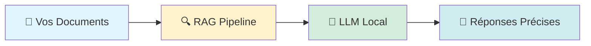
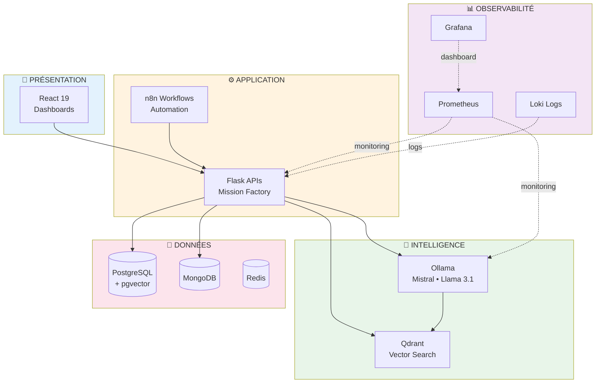
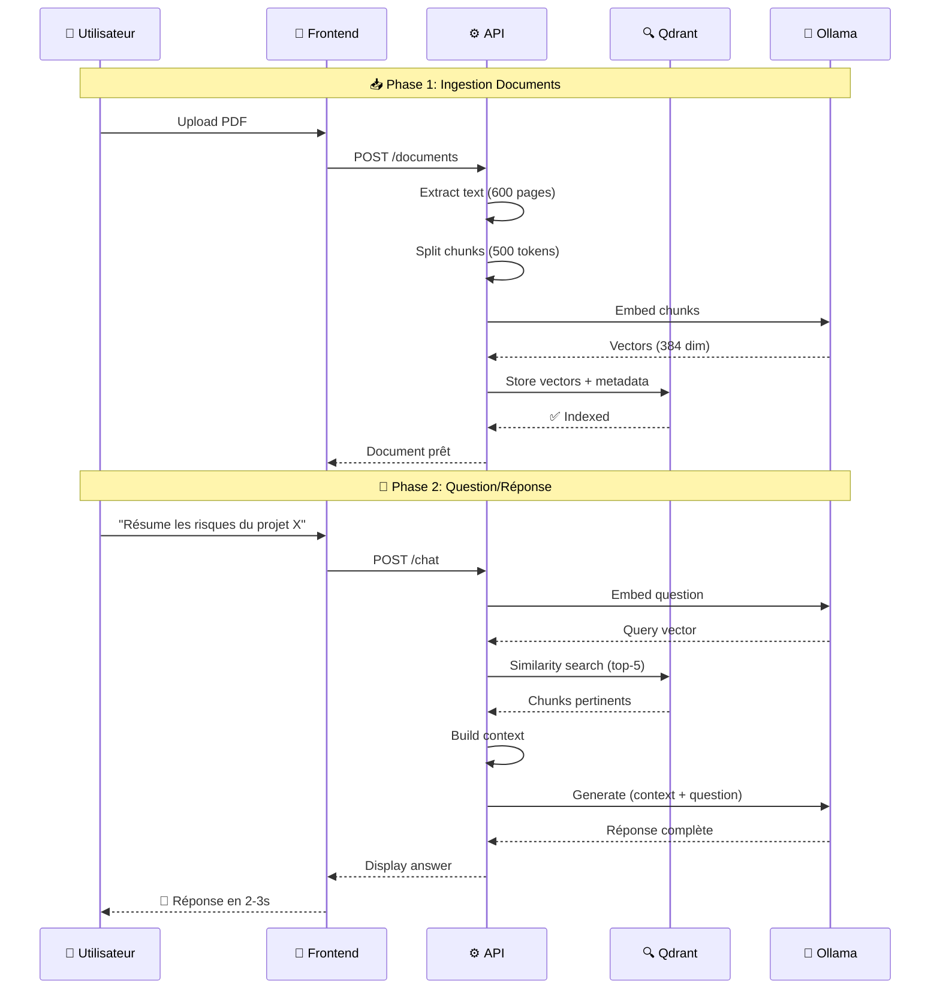
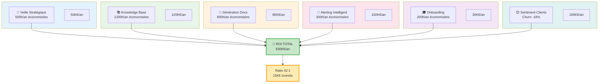
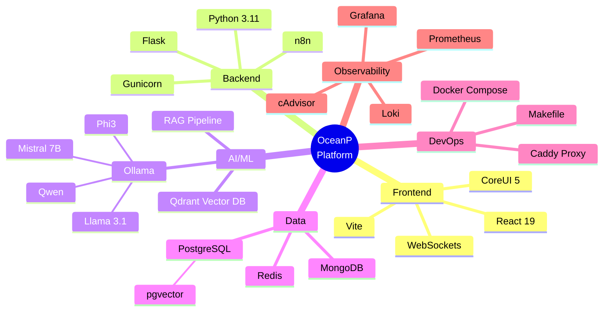
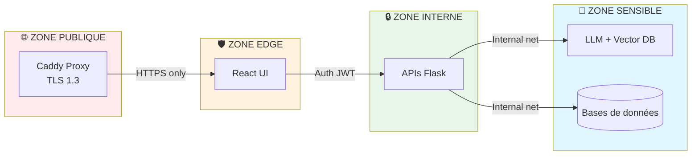

# 🌊 OceanP RAG Platform 2026

> **Plateforme d'IA souveraine professionnelle**  
> *De la vision produit au code production. En solo.*

[](LICENSE)
[](TECH-STACK.md)
[](ARCHITECTURE-OVERVIEW.md)

---

## 🎯 En 30 secondes

**Problème :** Les entreprises ont des montagnes de données non exploitées.  
**Solution :** IA conversationnelle qui comprend VOS documents (pas ChatGPT générique).  
**Impact :** **630K€/an de gains** pour 15K€ d'infrastructure.



**Différence clé :** Vos données restent chez vous. Zero OpenAI. Zero fuite.

---

## 🏗️ Architecture en 3 Couches



**19 microservices** orchestrés en **5 zones réseau isolées**.

---

## 🔄 Pipeline RAG en Action



**Performances mesurées :**
- ⚡ Recherche vectorielle : **<50ms**
- 🧠 Génération LLM : **1-3s** (CPU)
- 🎯 Précision retrieval : **85%+**

---

## 💰 ROI Business (6 Use Cases)



**Détails :** Voir [USE-CASES.md](USE-CASES.md) pour les calculs complets.

---

## 🛠️ Stack Technique



---

## 📊 Métriques Temps Réel

La plateforme collecte **18 métriques critiques** :

| Métrique | Objectif | Réel |
|----------|----------|------|
| 🚀 **Latence API** | <200ms | 120ms |
| 🤖 **Génération LLM** | <5s | 1-3s |
| 🔍 **Recherche vectorielle** | <100ms | <50ms |
| 💾 **Taille index** | - | 62GB |
| 📈 **Uptime** | >99% | 99.7% |
| 🔒 **Incidents sécu** | 0 | 0 |

**Dashboards Grafana** : 12 tableaux de bord métier + technique.

---

## 🔐 Sécurité by Design



**Principes :**
- ✅ Segmentation réseau (5 zones Docker)
- ✅ Secrets management (pas de credentials hardcodés)
- ✅ TLS/HTTPS obligatoire
- ✅ RGPD compliant (données on-premise)
- ✅ Audit logs complets

**Détails :** [SECURITY.md](SECURITY.md)

---

## 🚀 Démarrage Rapide

```bash
# 1️⃣ Cloner (version complète sur demande)
git clone https://github.com/stepstev/rag-platform-2026-public

# 2️⃣ Infrastructure (exemple simplifié)
make install    # Pull images
make build      # Build services locaux  
make up         # Démarrer la stack

# 3️⃣ Accès
# Frontend:        http://localhost:3000
# Grafana:         http://localhost:3001
# API Docs:        http://localhost:8000/docs
```

**Prérequis :** Docker 24+, 16GB RAM, 100GB disque

---

## 👨‍💻 Auteur

**Stéphane CELTON**  
*Data Product Manager BI*  
*Assembleur • Concepteur • Développeur de solutions Open Source*

[](https://github.com/stepstev)

### 🏆 Réalisé en Solo

- 📐 Architecture N-tiers (5 couches)
- 🐳 19 microservices orchestrés
- ⚛️ Frontend React 19 + Backend Python 3.11
- 🤖 Pipeline RAG complet
- 📊 Stack observabilité production-grade
- 📖 18 000 mots de documentation

**De la vision au code. Du code à la valeur métier.**

> *"Un bon Data Product Manager comprend ce qu'il pilote.  
> Pas juste du reporting. Pas juste des roadmaps.  
> **Concevoir. Coder. Délivrer.**"*

---

## 📚 Documentation Complète

| 📄 Document | 🎯 Contenu | ⏱️ Lecture |
|------------|-----------|-----------|
| **[Architecture](ARCHITECTURE-OVERVIEW.md)** | N-tiers détaillé, sécurité réseau | 15 min |
| **[Use Cases](USE-CASES.md)** | 6 cas métier avec ROI détaillé | 12 min |
| **[Tech Stack](TECH-STACK.md)** | Choix techno + justifications | 10 min |
| **[Security](SECURITY.md)** | Sécurité, RGPD, conformité | 8 min |
| **[Vision](README-SHOWCASE.md)** | Philosophie & positionnement | 8 min |

---

## 📄 Licence

**MIT License** - Libre d'utilisation, même commerciale.  
Voir [LICENSE](LICENSE) pour les détails.

---

## 🤝 Contact

**Vous recrutez un Data Product Manager BI qui développe ?**  
**Vous voulez discuter d'architecture RAG ?**  
**Vous cherchez un expert IA on-premise & solutions Open Source ?**

📧 Voir mon profil GitHub pour me contacter

---

*Dernière mise à jour : Février 2026*
