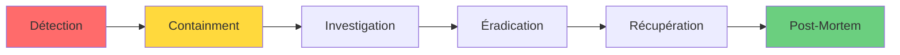

# 🔐 Security & Privacy - OceanP RAG Platform

> **Approche sécurité & confidentialité - Version publique**

---

## 🎯 Principes Fondamentaux

Cette plateforme a été conçue avec une approche **Security by Design** et **Privacy by Default** :

### 1. Souveraineté Technologique 🇫🇷
- ✅ **Zéro dépendance cloud externe** (AWS, Azure, GCP)
- ✅ **LLMs 100% locaux** (pas d'API OpenAI, Anthropic, etc.)
- ✅ **Données hébergées localement** (contrôle total)
- ✅ **Conformité RGPD native**

### 2. Défense en Profondeur 🛡️
- ✅ **Segmentation réseau** (isolation par domaine)
- ✅ **Principe du moindre privilège** (zéro trust)
- ✅ **Chiffrement en transit** (HTTPS, TLS)
- ✅ **Secrets management** (pas de credentials hardcodés)

### 3. Transparence & Traçabilité 📋
- ✅ **Logs centralisés** (audit trail complet)
- ✅ **Métriques exhaustives** (observabilité totale)
- ✅ **Open source** (code auditable)
- ✅ **Documentation publique** (cette page)

---

## 🔒 Mesures de Sécurité Implémentées

### Niveau Infrastructure

```yaml
Segmentation Réseau:
  EDGE:
    - Exposition: reverse proxy uniquement
    - TLS: auto-signé (dev) ou Let's Encrypt (prod)
    - Rate limiting: 100 req/min par IP
  
  INTERNAL:
    - Isolation: APIs backend
    - Accès: authentification JWT
    - CORS: domaines autorisés uniquement
  
  DATA:
    - Isolation: zéro accès direct externe
    - Accès: via APIs internes uniquement
    - Chiffrement: at-rest (LUKS) + in-transit (TLS)
  
  AI:
    - Isolation: workloads LLM séparés
    - Ressources: limites CPU/RAM strictes
    - Logs: sanitization (pas de données sensibles)
  
  OPS:
    - Monitoring: lecture seule externe
    - Alerting: canal sécurisé (Slack privé)
```

### Niveau Application

**Authentification & Autorisation**
- JWT tokens (expiration 24h)
- Refresh tokens (rotation automatique)
- RBAC (Role-Based Access Control)
- Session management (Redis)

**Secrets Management**
```bash
# Génération automatique (Makefile)
POSTGRES_PASSWORD=$(openssl rand -hex 32)
JWT_SECRET=$(openssl rand -hex 32)
REDIS_PASSWORD=$(openssl rand -hex 12)

# Stockage sécurisé
.env (gitignored)
Docker secrets (production)
```

**Input Validation**
- Sanitization systématique (XSS, SQL injection)
- Size limits (upload 50MB max)
- Content-Type validation
- Rate limiting par endpoint

### Niveau Données

**Chiffrement**
- ✅ At-rest : Volumes Docker chiffrés (option Linux LUKS)
- ✅ In-transit : TLS 1.3 minimum
- ✅ Backups : AES-256 chiffrement

**Anonymisation**
- PII détection automatique (regex patterns)
- Pseudonymisation conversations (hashing IDs)
- Logs sanitization (masquage emails, IPs)

**Rétention**
```yaml
Logs applicatifs: 30 jours
Métriques Prometheus: 15 jours
Conversations: configurable (défaut 90j)
Backups: 7 jours rolling + 1/mois archivé
```

---

## 🛡️ Conformité RGPD

### Droits Utilisateurs Implémentés

| Droit | Implémentation | API Endpoint |
|-------|----------------|--------------|
| **Accès** | Export JSON conversations | `GET /api/user/data` |
| **Rectification** | Modification profil | `PATCH /api/user/profile` |
| **Effacement** | Suppression complète | `DELETE /api/user/account` |
| **Portabilité** | Export JSON/CSV | `GET /api/user/export` |
| **Opposition** | Opt-out analytics | `POST /api/user/opt-out` |
| **Limitation** | Anonymisation partielle | `POST /api/user/anonymize` |

### Registre des Traitements

**Traitement 1 : Conversations IA**
- Finalité : Assistance intelligence artificielle
- Base légale : Consentement explicite
- Données : Messages utilisateur, réponses LLM
- Durée conservation : 90 jours
- Destinataires : Aucun (local seulement)

**Traitement 2 : Métriques Utilisation**
- Finalité : Amélioration service
- Base légale : Intérêt légitime
- Données : Timestamps, latences, erreurs (anonymisées)
- Durée conservation : 30 jours
- Destinataires : Administrateurs système

**Traitement 3 : Logs Audit**
- Finalité : Sécurité & conformité
- Base légale : Obligation légale
- Données : Actions utilisateur, IPs, timestamps
- Durée conservation : 1 an
- Destinataires : RSSI, auditeurs

---

## 🚨 Gestion des Incidents

### Procédure de Réponse



### Classification Incidents

| Sévérité | SLA | Exemples |
|----------|-----|----------|
| **P1 - Critique** | <15min | Data breach, service down complet |
| **P2 - Majeur** | <2h | Vulnérabilité exploitable, dégradation majeure |
| **P3 - Mineur** | <24h | Bug non-critique, performance dégradée |
| **P4 - Cosmétique** | <7j | UI glitch, typo documentation |

### Notification

**En cas de data breach :**
- Notification CNIL : <72h
- Notification utilisateurs affectés : <24h
- Communication publique si >1000 utilisateurs

---

## 🔍 Audits & Tests

### Tests de Sécurité

**Automated Scanning** (Continu)
- Dépendances vulnérables : `npm audit`, `pip-audit`
- Secrets exposés : `gitleaks`, `trufflehog`
- Container scanning : `trivy`, `grype`

**Manual Testing** (Mensuel)
- Pen-testing applicatif
- Code review sécurité
- Infrastructure audit

**Third-Party Audits** (Annuel)
- Audit conformité RGPD
- Pen-test externe certifié
- Infrastructure review

### Métriques Sécurité (SLIs)

```yaml
Vulnérabilités critiques: 0 (target)
Temps MTTD (Mean Time To Detect): <5min
Temps MTTR (Mean Time To Respond): <15min
Coverage logs audit: 100% actions critiques
Uptime monitoring: >99.9%
```

---

## ⚠️ Ce Document Public N'Expose PAS

Par sécurité, les éléments suivants ne sont **jamais** publiés :

### ❌ Informations Sensibles (Privées)

- **Architecture physique détaillée**
  - Adresses IP réelles
  - Topologie réseau complète
  - Schémas infrastructure

- **Configuration serveurs**
  - Versions exactes OS
  - Patchs appliqués
  - Services exposés

- **Procédures incident**
  - Runbooks détaillés
  - Contacts on-call
  - Escalation path

- **Résultats audits**
  - Vulnérabilités identifiées
  - Pen-test reports
  - False positives

- **Logs & métriques réelles**
  - IPs utilisateurs
  - Patterns d'attaque
  - Données de production

---

## 📞 Responsible Disclosure

### Signaler une Vulnérabilité

**Si vous découvrez une faille de sécurité :**

1. **NE PAS** publier publiquement
2. **Contactez-moi** en privé :
   - Email : [security@votredomaine.com]
   - PGP Key : [ID si applicable]
   - Signal : [Numéro si applicable]

3. **Fournissez** :
   - Description détaillée
   - Steps to reproduce
   - Impact estimé
   - Suggestions de fix (optionnel)

4. **Engagement** :
   - Accusé réception : <24h
   - Évaluation : <72h
   - Fix si confirmé : <7j (critique), <30j (non-critique)
   - Reconnaissance publique si souhaité (hall of fame)

### Hall of Fame 🏆

*Personne n'a encore signalé de vulnérabilité — soyez le premier !*

---

## 🔐 Best Practices Recommandées

### Pour les Utilisateurs

- ✅ Utiliser mots de passe forts (>12 caractères)
- ✅ Activer 2FA si disponible
- ✅ Ne jamais partager credentials
- ✅ Déconnexion après usage (sessions)
- ✅ Signaler comportements suspects

### Pour les Administrateurs

- ✅ Rotation secrets (trimestrielle)
- ✅ Revue logs audit (hebdomadaire)
- ✅ Mise à jour système (mensuelle)
- ✅ Backup testé (mensuel)
- ✅ Incident drill (trimestriel)

### Pour les Développeurs

- ✅ Code review obligatoire (2+ reviewers)
- ✅ SAST tools dans CI/CD
- ✅ Dépendances à jour (<3 mois)
- ✅ Secrets jamais commités
- ✅ Documentation sécurité à jour

---

## 📚 Ressources & Références

### Standards & Frameworks

- **OWASP Top 10** : [owasp.org](https://owasp.org/www-project-top-ten/)
- **NIST Cybersecurity Framework** : [nist.gov](https://www.nist.gov/cyberframework)
- **RGPD** : [cnil.fr](https://www.cnil.fr/)
- **ISO 27001** : Gestion sécurité information

### Outils Utilisés

- **Scanning** : Trivy, Grype, npm audit
- **Secrets** : GitLeaks, TruffleHog
- **Monitoring** : Prometheus, Grafana, Loki
- **SIEM** : Logs centralisés (Loki)

---

## 🎓 Philosophie Sécurité

> "La sécurité n'est pas un produit, c'est un processus."  
> — Bruce Schneier

Cette plateforme démontre qu'on peut construire une stack IA moderne, performante ET sécurisée, sans sacrifier :
- La souveraineté (contrôle total)
- La conformité (RGPD native)
- La transparence (open source)
- L'innovation (LLMs state-of-the-art)

**La sécurité est un feature, pas un afterthought.**

---

*Security Policy v1.0 - Dernière révision : Février 2026*  
*Pour signaler une vulnérabilité : security@votredomaine.com*
